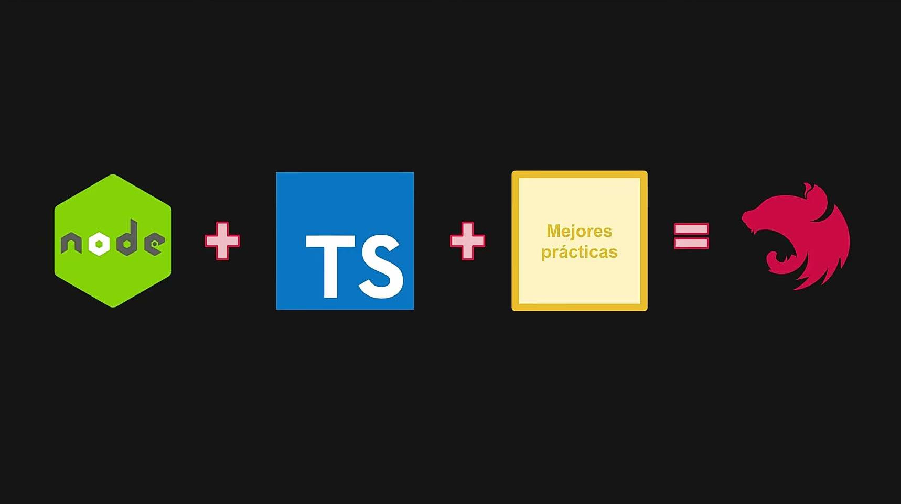

# [COURSE] "Nest.js Series".

# Section 1 - Intro.

#### What is Nest.js?

It's a server apps framework oriented to scalability and efficiency. Developed over TypeScript support too VanillaJs. Combine elements of OOP, Functional Programming and Reactive Programming.

#### What trouble it resolve?

Nest gives a scaffolding for a backend project based on Angular modular pattern.

# Section 2 - Hello world.

#### Nest scafold.

| file or folder            |                                              |
| ------------------------- | -------------------------------------------- |
| **./dist**                | Transpiled files of our project.             |
| **./src**                 | All our code.                                |
| **./test**                | e2e tests for our app and config for it.     |
| **./.prettierrc**         | Base config of prettier recommended by Nest. |
| **./nest-cli.json**       | Nest CLI config file.                        |
| **./tsconfig.build.json** | options for TypeScript transpilation.        |

#### Case types:
Camel case: `thisIsACamelCasedString`\
Pascal case: `ThisIsAPascalCasedString`\
Snake case: `finaly_this_is_snake_cased_string`